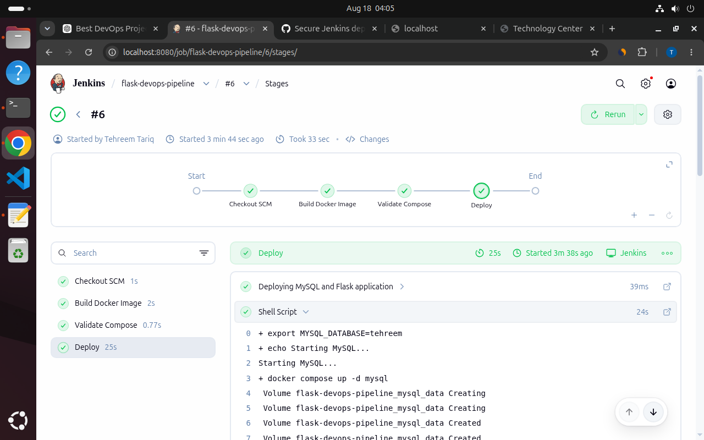
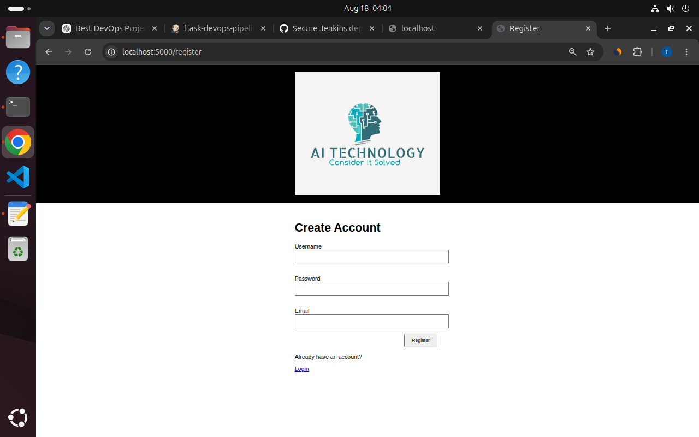
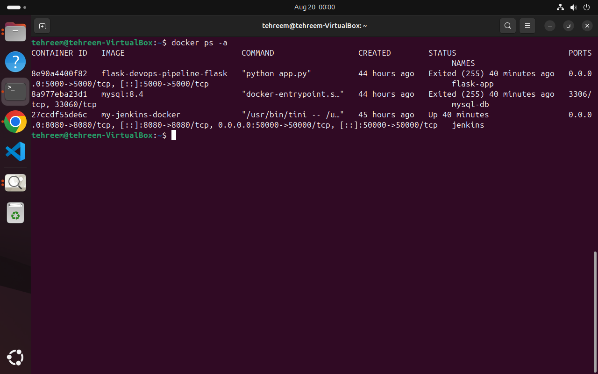
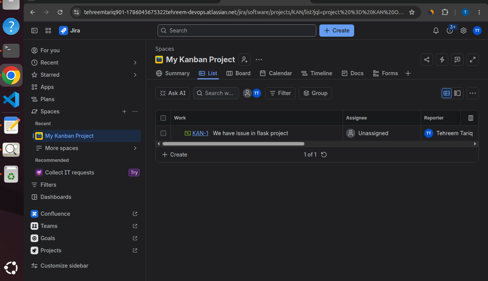

# Flask DevOps CI/CD Project

A production-oriented Flask web application integrated with MySQL and Jira, containerized with Docker, and automated using Jenkins CI/CD.

## Project Overview

This project demonstrates an end-to-end DevOps workflow for a Flask web application.

The application provides:

- User registration and login
- Trainer information management
- MySQL database integration
- Jira issue creation through the Jira API

The application is containerized using Docker and Docker Compose, version-controlled with Git and GitHub, and deployed through a Jenkins CI/CD pipeline.

## Architecture

```text
                GitHub
                   |
                   v
                Jenkins
                   |
        +----------+----------+
        |                     |
       CI                    CD
        |                     |
 Build Docker Image       Start MySQL
        |                     |
 Validate Compose         Restore Database
        |                     |
        +----------+----------+
                   |
              Flask + MySQL
                   |
              Running App
                   |
              Jira API
````

## Technologies Used

| Technology     | Purpose                      |
| -------------- | ---------------------------- |
| Python / Flask | Web application              |
| MySQL          | Database                     |
| Jira API       | Issue and ticket creation    |
| Docker         | Application containerization |
| Docker Compose | Multi-container management   |
| Git            | Version control              |
| GitHub         | Remote code repository       |
| Jenkins        | CI/CD automation             |

## Application Features

* User registration and login
* Trainer information management
* MySQL database integration
* Jira issue creation through the Jira API

## Dockerization

The Flask application is containerized using a custom `Dockerfile`.

The Dockerfile:

* Uses Python 3.11 Alpine as the base image
* Installs required system dependencies
* Installs Python dependencies from `requirements.txt`
* Copies the application into the container
* Starts the Flask application using `python app.py`

The MySQL service uses the official `mysql:8.4` Docker image.

## Docker Compose

Docker Compose manages the Flask and MySQL services.

The application uses:

* Flask container
* MySQL container
* Docker internal networking
* Persistent MySQL storage using a named volume

Flask connects to MySQL using the Docker Compose service name:

```text
mysql
```

## Database Initialization

The project contains a database backup:

```text
docker-entrypoint-initdb.d/tehreem.sql
```

During Jenkins deployment, the pipeline:

1. Starts MySQL
2. Waits until MySQL is ready
3. Checks whether the database contains tables
4. Imports `tehreem.sql` if the database is empty
5. Starts the Flask application

## Environment Variables and Secrets

Database credentials are kept outside the source code.

The project uses:

```text
MYSQL_ROOT_PASSWORD
MYSQL_DATABASE
MYSQL_USER
MYSQL_PASSWORD
```

The `.env` file is excluded from Git using `.gitignore`.

Jenkins Credentials are used to securely provide database credentials during pipeline execution.

## Jenkins CI/CD Pipeline

The pipeline is defined in:

```text
Jenkinsfile
```

### Continuous Integration

```text
GitHub
   |
   v
Jenkins
   |
   v
Build Docker Image
   |
   v
Validate Docker Compose
```

### Continuous Deployment

```text
Start MySQL
   |
   v
Wait for MySQL readiness
   |
   v
Initialize database if required
   |
   v
Start Flask application
```

The Jenkins pipeline successfully completed the build, validation, database initialization, and application deployment stages.

## CI/CD Workflow

```text
Code Change
    |
    v
GitHub
    |
    v
Jenkins
    |
    +--> Build Docker Image
    |
    +--> Validate Docker Compose
    |
    +--> Start MySQL
    |
    +--> Restore Database
    |
    +--> Start Flask
    |
    v
Running Application
```

## Screenshots

### Jenkins CI/CD Pipeline



### Running Application



### Docker Containers



### Jira Integration



## How to Run Locally

### Clone the Repository

```bash
git clone https://github.com/tehreem-tariq901/flask-devops-ci-cd.git
cd flask-devops-ci-cd
```

### Configure Environment Variables

Create a `.env` file with the required MySQL configuration.

Do not commit `.env` to Git.

### Build and Start the Application

```bash
docker compose up --build
```

### Open the Application

```text
http://localhost:5000
```

## Project Highlights

* End-to-end Jenkins CI/CD pipeline
* Dockerized Flask application
* MySQL containerized database
* Automated database initialization
* Secure Jenkins credential management
* Docker Compose based deployment
* Jira API integration
* GitHub-based source control

## Future Improvements

* Automatic GitHub webhook trigger for Jenkins
* Automated application tests in CI
* Docker image publishing to a container registry
* AWS deployment
* Monitoring and logging

## GitHub Repository

[https://github.com/tehreem-tariq901/flask-devops-ci-cd](https://github.com/tehreem-tariq901/flask-devops-ci-cd)


